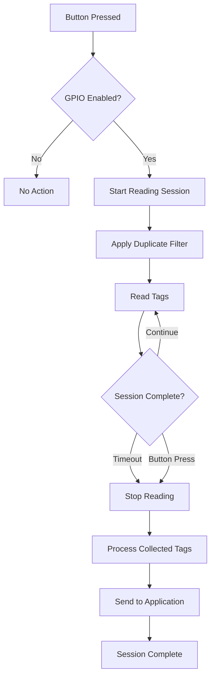

# 🎛️ GPIO Control Guide

Complete guide to using hardware GPIO buttons on the Zebra FXP20 for hands-free tag reading control.

---

## 🎯 GPIO Overview

**GPIO (General Purpose Input/Output)** allows you to use physical hardware buttons on your Zebra FXP20 device to control tag reading sessions. This enables:

- **👋 Hands-Free Operation**: Start/stop reading without touching the application
- **⏱️ Timed Reading Sessions**: Read tags for a specified duration
- **🔄 Duplicate Filtering**: Remove duplicate tags during button-triggered sessions
- **📊 Session Management**: Controlled reading periods for better data quality

---

## 🔧 GPIO Hardware Setup

### FXP20 GPIO Buttons

The Zebra FXP20 typically includes:
- **🔴 Primary Trigger Button**: Main GPIO button for tag reading
- **🟡 Secondary Buttons**: Additional buttons (device-dependent)
- **📱 Side Buttons**: Volume/function buttons that can be mapped

### Button Identification
1. **🔍 Locate** physical buttons on your FXP20 device
2. **📋 Refer** to FXP20 hardware documentation for GPIO pin mapping
3. **🧪 Test** different buttons to identify which triggers GPIO events
4. **📝 Document** working button configuration for your team

---

## ⚙️ GPIO Configuration

### Basic GPIO Settings

Configure GPIO functionality in Config.xml:

```xml
<?xml version="1.0" encoding="utf-8"?>
<FXP20KeyInjectorConfig>
  <!-- GPIO Hardware Control -->
  <HookGPIOToStartReading>true</HookGPIOToStartReading>
  <GPIOReadingDurationInMs>5000</GPIOReadingDurationInMs>
  <GPIOPin>1</GPIOPin>
  
  <!-- Duplicate Filtering for GPIO Sessions -->
  <RemoveDuplicates>true</RemoveDuplicates>
  
  <!-- Audio Feedback -->
  <BeepOnRead>true</BeepOnRead>
  <BeepDuration>200</BeepDuration>
</FXP20KeyInjectorConfig>
```

### Configuration Parameters

#### GPIO Control Settings
```xml
<!-- Enable GPIO button control -->
<HookGPIOToStartReading>true</HookGPIOToStartReading>

<!-- Reading duration in milliseconds (5 seconds = 5000ms) -->
<GPIOReadingDurationInMs>5000</GPIOReadingDurationInMs>

<!-- GPIO pin number (hardware-specific) -->
<GPIOPin>1</GPIOPin>

<!-- GPIO trigger mode -->
<GPIOTriggerMode>PRESS</GPIOTriggerMode>  <!-- PRESS, RELEASE, HOLD -->
```

#### Session Management
```xml
<!-- Duplicate tag handling during GPIO sessions -->
<RemoveDuplicates>true</RemoveDuplicates>

<!-- Session timeout if no tags read -->
<GPIOSessionTimeout>30000</GPIOSessionTimeout>

<!-- Continuous reading mode -->
<ContinuousGPIOReading>false</ContinuousGPIOReading>
```

#### Audio Feedback
```xml
<!-- Beep when tag is read -->
<BeepOnRead>true</BeepOnRead>

<!-- Beep duration in milliseconds -->
<BeepDuration>200</BeepDuration>

<!-- Session start/stop beeps -->
<BeepOnSessionStart>true</BeepOnSessionStart>
<BeepOnSessionEnd>true</BeepOnSessionEnd>
```

---

## 🎮 GPIO Operation Modes

### Mode 1: Timed Reading Sessions (Recommended)

**How it works:**
1. **🔘 Press** GPIO button
2. **▶️ Reading starts** immediately
3. **⏱️ Reads** for specified duration (e.g., 5 seconds)
4. **⏹️ Stops** automatically after timeout
5. **🔄 Filters** duplicate tags during session

**Configuration:**
```xml
<HookGPIOToStartReading>true</HookGPIOToStartReading>
<GPIOReadingDurationInMs>5000</GPIOReadingDurationInMs>
<RemoveDuplicates>true</RemoveDuplicates>
<ContinuousGPIOReading>false</ContinuousGPIOReading>
```

**Best for:**
- ✅ Inventory counting
- ✅ Quality control scanning
- ✅ Batch processing
- ✅ Hands-free operation

### Mode 2: Toggle Reading (Press to Start/Stop)

**How it works:**
1. **🔘 First press** - Start reading
2. **🔄 Continuous reading** until next button press
3. **🔘 Second press** - Stop reading
4. **⏱️ No automatic timeout**

**Configuration:**
```xml
<HookGPIOToStartReading>true</HookGPIOToStartReading>
<GPIOReadingDurationInMs>0</GPIOReadingDurationInMs>  <!-- 0 = no timeout -->
<ContinuousGPIOReading>true</ContinuousGPIOReading>
<RemoveDuplicates>true</RemoveDuplicates>
```

**Best for:**
- ✅ Long scanning sessions
- ✅ Continuous monitoring
- ✅ User-controlled duration
- ✅ Flexible timing needs

### Mode 3: Hold-to-Read

**How it works:**
1. **🔘 Hold** GPIO button down
2. **▶️ Reading active** while button held
3. **🔘 Release** button to stop
4. **⏹️ Immediate stop** on release

**Configuration:**
```xml
<HookGPIOToStartReading>true</HookGPIOToStartReading>
<GPIOTriggerMode>HOLD</GPIOTriggerMode>
<GPIOReadingDurationInMs>0</GPIOReadingDurationInMs>
<RemoveDuplicates>false</RemoveDuplicates>  <!-- Real-time reading -->
```

**Best for:**
- ✅ Precise timing control
- ✅ Single tag reads
- ✅ Training scenarios
- ✅ Demo purposes

---

## 📊 GPIO Session Management

### Session Workflow



### Duplicate Filtering During Sessions

When `RemoveDuplicates` is enabled:
- **📊 Session Buffer**: Stores unique tags during reading session
- **🔍 Duplicate Check**: Compares each new tag against session buffer
- **✅ Unique Tags**: Added to buffer and processed immediately
- **❌ Duplicate Tags**: Ignored during the same session
- **🧹 Buffer Clear**: Cleared at end of each session

**Example Session:**
1. **▶️ Start**: Button pressed, session begins
2. **🏷️ Tag A**: First read - added to buffer, sent to application
3. **🏷️ Tag A**: Second read - duplicate, ignored
4. **🏷️ Tag B**: New tag - added to buffer, sent to application
5. **🏷️ Tag A**: Third read - still duplicate, ignored
6. **⏹️ End**: Session timeout, buffer cleared

---

## 🔧 Advanced GPIO Configuration

### Hardware-Specific Settings

#### GPIO Pin Mapping
```xml
<!-- Pin assignments (device-specific) -->
<GPIOPin>1</GPIOPin>                 <!-- Primary trigger button -->
<GPIOSecondaryPin>2</GPIOSecondaryPin> <!-- Secondary button -->

<!-- Pin active state -->
<GPIOActiveHigh>false</GPIOActiveHigh>  <!-- true = HIGH active, false = LOW active -->

<!-- Debounce settings -->
<GPIODebounceMs>50</GPIODebounceMs>    <!-- Debounce time in milliseconds -->
```

#### Trigger Sensitivity
```xml
<!-- Button press detection -->
<GPIOMinPressTime>100</GPIOMinPressTime>     <!-- Minimum press duration -->
<GPIOMaxPressTime>10000</GPIOMaxPressTime>   <!-- Maximum press duration -->

<!-- Multi-press detection -->
<GPIODoubleClickTime>500</GPIODoubleClickTime> <!-- Double-click window -->
<GPIODoubleClickAction>CLEAR</GPIODoubleClickAction> <!-- Action on double-click -->
```

### Session Timeout Configuration
```xml
<!-- Reading session timeouts -->
<GPIOReadingDurationInMs>5000</GPIOReadingDurationInMs>  <!-- Active reading time -->
<GPIOSessionTimeout>30000</GPIOSessionTimeout>           <!-- Max session duration -->
<GPIOIdleTimeout>60000</GPIOIdleTimeout>                 <!-- Idle timeout -->

<!-- Timeout actions -->
<GPIOTimeoutAction>STOP</GPIOTimeoutAction>              <!-- STOP, CONTINUE, RESTART -->
```

### Multi-Button Support
```xml
<!-- Multiple GPIO buttons -->
<GPIOButton1Pin>1</GPIOButton1Pin>
<GPIOButton1Action>START_READING</GPIOButton1Action>
<GPIOButton1Duration>5000</GPIOButton1Duration>

<GPIOButton2Pin>2</GPIOButton2Pin>
<GPIOButton2Action>STOP_READING</GPIOButton2Action>

<GPIOButton3Pin>3</GPIOButton3Pin>
<GPIOButton3Action>BEEP</GPIOButton3Action>
```

---

## 🧪 GPIO Testing and Calibration

### Initial GPIO Testing

#### Test GPIO Responsiveness
1. **⚙️ Configure** basic GPIO settings
2. **🔗 Connect** to FXP20 device
3. **🔘 Press** GPIO button
4. **👁️ Monitor** application status indicators
5. **📊 Check** for "Reading started" messages
6. **⏱️ Verify** session duration timing

#### Test Session Management
1. **🔘 Press** button to start session
2. **🏷️ Present** same tag multiple times during session
3. **✅ Verify** duplicate filtering works
4. **⏱️ Wait** for session timeout
5. **📊 Check** that reading stops automatically

#### Test Audio Feedback
1. **⚙️ Enable** beep settings
2. **🔘 Press** GPIO button
3. **🔊 Listen** for session start beep
4. **🏷️ Present** tag
5. **🔊 Listen** for tag read beep
6. **⏱️ Wait** for session end beep

### Calibration Procedures

#### Timing Calibration
- **⏱️ Short Sessions**: 2-3 seconds for single tags
- **⏱️ Medium Sessions**: 5-10 seconds for small batches  
- **⏱️ Long Sessions**: 15-30 seconds for large batches
- **⏱️ Continuous**: Use toggle mode for unlimited duration

#### Sensitivity Adjustment
```xml
<!-- Fine-tune button sensitivity -->
<GPIODebounceMs>25</GPIODebounceMs>      <!-- Reduce for more sensitive -->
<GPIOMinPressTime>50</GPIOMinPressTime>   <!-- Minimum valid press -->
```

---

## 📋 GPIO Use Cases

### Inventory Management
**Scenario:** Warehouse inventory counting
```xml
<HookGPIOToStartReading>true</HookGPIOToStartReading>
<GPIOReadingDurationInMs>10000</GPIOReadingDurationInMs>  <!-- 10 second sessions -->
<RemoveDuplicates>true</RemoveDuplicates>
<BeepOnRead>true</BeepOnRead>
```

**Workflow:**
1. **📋 Approach** inventory shelf
2. **🔘 Press** button to start 10-second session
3. **🏷️ Scan** all items in area
4. **🔄 Duplicates** automatically filtered
5. **⏹️ Session ends** automatically
6. **📊 Move** to next area, repeat

### Quality Control
**Scenario:** Manufacturing quality checks
```xml
<HookGPIOToStartReading>true</HookGPIOToStartReading>
<GPIOReadingDurationInMs>3000</GPIOReadingDurationInMs>   <!-- 3 second sessions -->
<RemoveDuplicates>false</RemoveDuplicates>                <!-- Allow re-reads -->
<BeepOnRead>true</BeepOnRead>
```

**Workflow:**
1. **🔘 Press** button at each station
2. **🏷️ Scan** product tag
3. **✅ Verify** expected tag read
4. **📊 Data** logged for tracking
5. **🔄 Repeat** for each product

### Access Control
**Scenario:** Badge/ID verification
```xml
<HookGPIOToStartReading>true</HookGPIOToStartReading>
<GPIOTriggerMode>HOLD</GPIOTriggerMode>                   <!-- Hold to read -->
<RemoveDuplicates>false</RemoveDuplicates>
<BeepOnRead>true</BeepOnRead>
```

**Workflow:**
1. **🔘 Hold** button
2. **🏷️ Present** ID card/badge
3. **🔊 Beep** confirms read
4. **🔘 Release** button
5. **🔐 Access** granted/denied

---

## 🔧 GPIO Troubleshooting

### Common GPIO Issues

#### Button Press Not Detected
**Symptoms:**
- 🔘 Pressing button has no effect
- 📊 No status change in application
- 🔊 No audio feedback

**Solutions:**
1. **🔍 Check** GPIO pin configuration
2. **🧪 Test** different pin numbers
3. **⚙️ Adjust** debounce settings
4. **📱 Verify** FXP20 hardware functionality
5. **🔄 Restart** application

#### Inconsistent Button Response
**Symptoms:**
- 🔘 Button sometimes works, sometimes doesn't
- ⏱️ Inconsistent timing behavior
- 📊 Missed button presses

**Solutions:**
```xml
<!-- Increase debounce time -->
<GPIODebounceMs>100</GPIODebounceMs>

<!-- Adjust sensitivity -->
<GPIOMinPressTime>200</GPIOMinPressTime>
<GPIOActiveHigh>false</GPIOActiveHigh>
```

#### Session Duration Issues
**Symptoms:**
- ⏱️ Sessions too short/long
- 🔄 Sessions don't end properly
- 📊 Reading continues indefinitely

**Solutions:**
1. **⏱️ Adjust** `GPIOReadingDurationInMs`
2. **🔧 Set** appropriate timeout values
3. **🧪 Test** with different durations
4. **📊 Monitor** session status indicators

#### Duplicate Filtering Problems
**Symptoms:**
- 🏷️ Same tag read multiple times in session
- 📊 Expected tags not appearing
- 🔄 Filtering too aggressive

**Solutions:**
```xml
<!-- Fine-tune duplicate filtering -->
<RemoveDuplicates>true</RemoveDuplicates>
<DuplicateTimeoutMs>1000</DuplicateTimeoutMs>        <!-- Custom timeout -->
<DuplicateMatchMode>EXACT</DuplicateMatchMode>       <!-- EXACT, PARTIAL -->
```

### Hardware Troubleshooting

#### GPIO Hardware Check
1. **📱 Test** buttons in other FXP20 applications
2. **🔍 Verify** button physical condition
3. **📊 Check** FXP20 firmware version
4. **📋 Consult** FXP20 hardware documentation

#### Connection Issues
1. **🔌 Check** USB connection quality
2. **🔄 Restart** FXP20 device
3. **👤 Run** application as Administrator
4. **⚙️ Update** FXP20 device drivers

---

## 📊 GPIO Performance Optimization

### Optimal Settings for Common Scenarios

#### High-Volume Scanning
```xml
<!-- Optimized for speed and accuracy -->
<GPIOReadingDurationInMs>3000</GPIOReadingDurationInMs>
<RemoveDuplicates>true</RemoveDuplicates>
<GPIODebounceMs>25</GPIODebounceMs>
<BeepOnRead>false</BeepOnRead>  <!-- Disable for speed -->
```

#### Precision Scanning
```xml
<!-- Optimized for accuracy over speed -->
<GPIOReadingDurationInMs>8000</GPIOReadingDurationInMs>
<RemoveDuplicates>true</RemoveDuplicates>
<GPIODebounceMs>100</GPIODebounceMs>
<BeepOnRead>true</BeepOnRead>
```

#### Battery Conservation
```xml
<!-- Minimize power usage -->
<GPIOReadingDurationInMs>2000</GPIOReadingDurationInMs>  <!-- Short sessions -->
<BeepOnRead>false</BeepOnRead>                            <!-- No audio -->
<GPIOIdleTimeout>30000</GPIOIdleTimeout>                  <!-- Quick timeout -->
```

---

## 📚 Related Resources

- **[Configuration Guide](Configuration.md)** - Complete Config.xml reference
- **[User Interface Guide](User-Interface.md)** - GUI GPIO controls  
- **[Setup Guide](Setup.md)** - Initial device configuration
- **[Troubleshooting Guide](Troubleshooting.md)** - Hardware troubleshooting

---

*GPIO configured for hands-free operation? Check the [User Interface Guide](User-Interface.md) for additional controls or return to [Home](Home.md).*