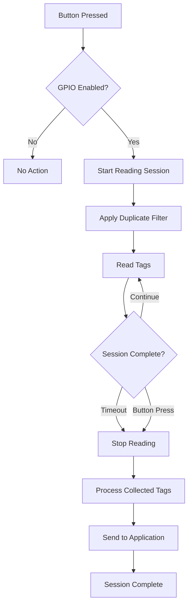

# 🎛️ GPIO Control Guide

Complete guide to using hardware GPIO buttons on the Zebra FXP20 for hands-free tag reading control.

---

## 🎯 GPIO Overview

**GPIO (General Purpose Input/Output)** allows you to use physical hardware buttons on your Zebra FXP20 device to control tag reading sessions. This enables:

- **👋 Hands-Free Operation**: Start/stop reading without touching the application
- **⏱️ Timed Reading Sessions**: Read tags for a specified duration
- **🔄 Duplicate Filtering**: Remove duplicate tags during button-triggered sessions
- **📊 Session Management**: Controlled reading periods for better data quality

---

## 🔧 GPIO Hardware Setup

### FXP20 GPIO Buttons

The Zebra FXP20 typically includes:
- **🔴 Primary Trigger Button**: Main GPIO button for tag reading
- **🟡 Secondary Buttons**: Additional buttons (device-dependent)
- **📱 Side Buttons**: Volume/function buttons that can be mapped

### Button Identification
1. **🔍 Locate** physical buttons on your FXP20 device
2. **📋 Refer** to FXP20 hardware documentation for GPIO pin mapping
3. **🧪 Test** different buttons to identify which triggers GPIO events
4. **📝 Document** working button configuration for your team

---

## ⚙️ GPIO Configuration

### Basic GPIO Settings

Configure GPIO functionality in Config.xml:

```xml
<?xml version="1.0" encoding="utf-8"?>
<Configuration>
  <!-- GPIO Hardware Control -->
  <PerformReadingWithGPIO>true</PerformReadingWithGPIO>
  <PerformReadingDuration>5000</PerformReadingDuration>
  <PerformReadingGPIOPort>1</PerformReadingGPIOPort>
  
  <!-- Duplicate Filtering for GPIO Sessions -->
  <RemoveDuplicates>true</RemoveDuplicates>
  
  <!-- Audio Feedback -->
  <BeepOnRead>true</BeepOnRead>
  <nbBeeps>1</nbBeeps>
  <beepSleepTime>400</beepSleepTime>
</Configuration>
```

### Configuration Parameters

#### GPIO Control Settings
```xml
<!-- Enable GPIO button control -->
<PerformReadingWithGPIO>true</PerformReadingWithGPIO>

<!-- Reading duration in milliseconds (5 seconds = 5000ms) -->
<PerformReadingDuration>5000</PerformReadingDuration>

<!-- GPIO pin number (hardware-specific) -->
<PerformReadingGPIOPort>1</PerformReadingGPIOPort>

```

#### Session Management
```xml
<!-- Duplicate tag handling during GPIO sessions -->
<RemoveDuplicates>true</RemoveDuplicates>

```

#### Audio Feedback
```xml
<!-- Beep when tag is read -->
<BeepOnRead>true</BeepOnRead>
<nbBeeps>1</nbBeeps>
<beepSleepTime>400</beepSleepTime>

```

---

## 🎮 GPIO Operation Modes

### Timed Reading Sessions

**How it works:**
1. **🔘 Press** GPIO button
2. **▶️ Reading starts** immediately
3. **⏱️ Reads** for specified duration (e.g., 5 seconds)
4. **⏹️ Stops** automatically after timeout
5. **🔄 Filters** duplicate tags during session

**Configuration:**
```xml
<PerformReadingWithGPIO>true</PerformReadingWithGPIO>
<PerformReadingDuration>5000</PerformReadingDuration>
<RemoveDuplicates>true</RemoveDuplicates>
```

**Best for:**
- ✅ Inventory counting
- ✅ Quality control scanning
- ✅ Batch processing
- ✅ Hands-free operation


---

## 📊 GPIO Session Management

### Session Workflow



### Duplicate Filtering During Sessions

When `RemoveDuplicates` is enabled:
- **📊 Session Buffer**: Stores unique tags during reading session
- **🔍 Duplicate Check**: Compares each new tag against session buffer
- **✅ Unique Tags**: Added to buffer and processed immediately
- **❌ Duplicate Tags**: Ignored during the same session
- **🧹 Buffer Clear**: Cleared at end of each session

**Example Session:**
1. **▶️ Start**: Button pressed, session begins
2. **🏷️ Tag A**: First read - added to buffer, sent to application
3. **🏷️ Tag A**: Second read - duplicate, ignored
4. **🏷️ Tag B**: New tag - added to buffer, sent to application
5. **🏷️ Tag A**: Third read - still duplicate, ignored
6. **⏹️ End**: Session timeout, buffer cleared

---

## 🔧 GPIO Pin Configuration

### Hardware-Specific Settings

#### GPIO Port Selection
```xml
<!-- GPIO port number (device-specific) -->
<PerformReadingGPIOPort>1</PerformReadingGPIOPort>
```

- Multi-press detection
- Session timeout management
- Multiple button support
- GPIO trigger sensitivity

These features are managed by the FXP20 device firmware to ensure optimal performance and reliability.

---

## 🧪 GPIO Testing and Calibration

### Initial GPIO Testing

#### Test GPIO Responsiveness
1. **⚙️ Configure** basic GPIO settings
2. **🔗 Connect** to FXP20 device
3. **🔘 Press** GPIO button
4. **👁️ Monitor** application status indicators
5. **📊 Check** for "Reading started" messages
6. **⏱️ Verify** session duration timing

#### Test Session Management
1. **🔘 Press** button to start session
2. **🏷️ Present** same tag multiple times during session
3. **✅ Verify** duplicate filtering works
4. **⏱️ Wait** for session timeout
5. **📊 Check** that reading stops automatically

#### Test Audio Feedback
1. **⚙️ Enable** beep settings
2. **🔘 Press** GPIO button
3. **🔊 Listen** for session start beep
4. **🏷️ Present** tag
5. **🔊 Listen** for tag read beep
6. **⏱️ Wait** for session end beep

### Calibration Procedures

#### Timing Calibration
- **⏱️ Short Sessions**: 2-3 seconds for single tags
- **⏱️ Medium Sessions**: 5-10 seconds for small batches  
- **⏱️ Long Sessions**: 15-30 seconds for large batches
- **⏱️ Continuous**: Use toggle mode for unlimited duration


---

## 📋 GPIO Use Cases

### Inventory Management
**Scenario:** Warehouse inventory counting
```xml
<PerformReadingWithGPIO>true</PerformReadingWithGPIO>
<PerformReadingDuration>10000</PerformReadingDuration>  <!-- 10 second sessions -->
<RemoveDuplicates>true</RemoveDuplicates>
<BeepOnRead>true</BeepOnRead>
```

**Workflow:**
1. **📋 Approach** inventory shelf
2. **🔘 Press** button to start 10-second session
3. **🏷️ Scan** all items in area
4. **🔄 Duplicates** automatically filtered
5. **⏹️ Session ends** automatically
6. **📊 Move** to next area, repeat

### Quality Control
**Scenario:** Manufacturing quality checks
```xml
<PerformReadingWithGPIO>true</PerformReadingWithGPIO>
<PerformReadingDuration>3000</PerformReadingDuration>   <!-- 3 second sessions -->
<RemoveDuplicates>false</RemoveDuplicates>                <!-- Allow re-reads -->
<BeepOnRead>true</BeepOnRead>
```

**Workflow:**
1. **🔘 Press** button at each station
2. **🏷️ Scan** product tag
3. **✅ Verify** expected tag read
4. **📊 Data** logged for tracking
5. **🔄 Repeat** for each product

### Access Control
**Scenario:** Badge/ID verification
```xml
<PerformReadingWithGPIO>true</PerformReadingWithGPIO>
<PerformReadingDuration>2000</PerformReadingDuration>     <!-- Short 2-second sessions -->
<RemoveDuplicates>false</RemoveDuplicates>
<BeepOnRead>true</BeepOnRead>
```

**Workflow:**
1. **🔘 Press** button to start 2-second reading session
2. **🏷️ Present** ID card/badge immediately
3. **🔊 Beep** confirms read
4. **⏱️ Session** ends automatically
5. **🔐 Access** granted/denied


---

## 🔧 GPIO Troubleshooting

### Common GPIO Issues

#### Button Press Not Detected
**Symptoms:**
- 🔘 Pressing button has no effect
- 📊 No status change in application
- 🔊 No audio feedback

**Solutions:**
1. **🔍 Check** GPIO pin configuration
2. **🧪 Test** different pin numbers
3. **⚙️ Adjust** debounce settings
4. **📱 Verify** FXP20 hardware functionality
5. **🔄 Restart** application

#### Inconsistent Button Response
**Symptoms:**
- 🔘 Button sometimes works, sometimes doesn't
- ⏱️ Inconsistent timing behavior
- 📊 Missed button presses

**Solutions:**
1. **🧪 Test** different GPIO port numbers in configuration
2. **📱 Verify** FXP20 hardware functionality
3. **🔄 Restart** application and device
4. **📋 Consult** FXP20 hardware documentation


#### Session Duration Issues
**Symptoms:**
- ⏱️ Sessions too short/long
- 🔄 Sessions don't end properly
- 📊 Reading continues indefinitely

**Solutions:**
1. **⏱️ Adjust** `PerformReadingDuration`
2. **🧪 Test** with different durations
3. **📊 Monitor** session status indicators
4. **🔄 Restart** application if sessions don't end properly


#### Duplicate Filtering Problems
**Symptoms:**
- 🏷️ Same tag read multiple times in session
- 📊 Expected tags not appearing
- 🔄 Filtering too aggressive

**Solutions:**
```xml
<!-- Enable or disable duplicate filtering -->
<RemoveDuplicates>true</RemoveDuplicates>  <!-- true = filter duplicates, false = allow all reads -->
```


### Hardware Troubleshooting

#### GPIO Hardware Check
1. **📱 Test** buttons in other FXP20 applications
2. **🔍 Verify** button physical condition
3. **📊 Check** FXP20 firmware version
4. **📋 Consult** FXP20 hardware documentation

#### Connection Issues
1. **🔌 Check** USB connection quality
2. **🔄 Restart** FXP20 device
3. **👤 Run** application as Administrator
4. **⚙️ Update** FXP20 device drivers

---

## 📊 GPIO Performance Optimization

### Optimal Settings for Common Scenarios

#### High-Volume Scanning
```xml
<!-- Optimized for speed and accuracy -->
<PerformReadingDuration>3000</PerformReadingDuration>
<RemoveDuplicates>true</RemoveDuplicates>
<BeepOnRead>false</BeepOnRead>  <!-- Disable for speed -->
```

#### Precision Scanning
```xml
<!-- Optimized for accuracy over speed -->
<PerformReadingDuration>8000</PerformReadingDuration>
<RemoveDuplicates>true</RemoveDuplicates>
<BeepOnRead>true</BeepOnRead>
```

#### Power Conservation  
```xml
<!-- Minimize power usage -->
<PerformReadingDuration>2000</PerformReadingDuration>  <!-- Short sessions -->
<BeepOnRead>false</BeepOnRead>                            <!-- No audio -->
```


---

## 📚 Related Resources

- **[Configuration Guide](Configuration.md)** - Complete Config.xml reference
- **[User Interface Guide](User-Interface.md)** - GUI GPIO controls  
- **[Setup Guide](Setup.md)** - Initial device configuration
- **[Troubleshooting Guide](Troubleshooting.md)** - Hardware troubleshooting

---

*GPIO configured for hands-free operation? Check the [User Interface Guide](User-Interface.md) for additional controls or return to [Home](Home.md).*